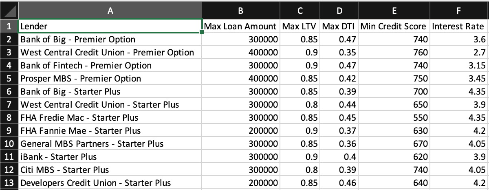
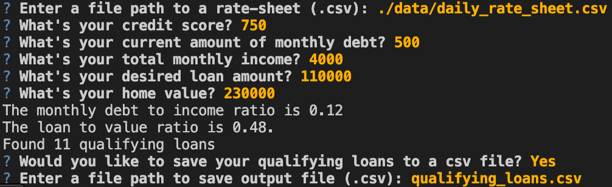

# Loan Qualifier

This application allows users to easily see what loans they are eligible to get from various banks.  It prompts for a bank rate sheet of lender criteria, and a few pieces of customer data about the loan they are seeking, and then it automates the process of determining which banks can meet their lending needs.

---

## Technologies

This application is written in Python 3.7 and uses the following packages:
* [fire](https://google.github.io/python-fire/guide/) - For basic command line interface.
* [questionary](https://questionary.readthedocs.io/en/stable/) - For interactive user prompts and dialog.
* [pytest](https://docs.pytest.org) - For unit tests.

---

## Installation Guide

Before running the application, install the dependencies:
```bash
pip install fire
pip install questionary
pip install pytest
```

---

## Examples

Here is an example csv output file created by this application, containing the qualifying loans for a user.



---

## Usage

Run the application in python
```python
python app.py
```

It will prompt for the rate sheet and customer information, then it will provide you with the number of qualifying loans and the option to save it to a csv output file.



---

## Contributors

Michael Danenberg

---

## License

MIT
